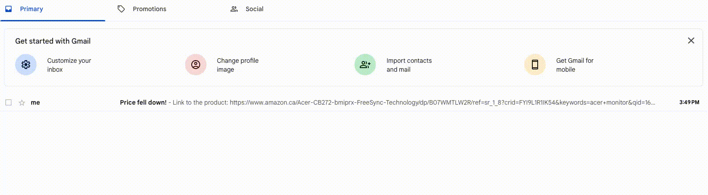

# Amazon Web Scraper
## About
A Python script that tracks the price of an Amazon product and sends an email to notify the user when the price goes down.

## Demo 
### When the price becomes lower


### Email


## Notes
* If you get the AttributeError: 'NoneType' object has no attribute 'get_text', then Amazon is blocking the request. The ids are correct as of August 2023, and it does not change if you use lxml, html.parser, or html5lib. 
* If you print(soup) and look in the body, you will see a captcha prompt from amazon essentially saying you have to prove you are not a robot.
* Once you run the code, the process will run continously until you exit the program manually.

## Generating a mail password in your Google account
* You can generate a separate [mail password](https://knowledge.workspace.google.com/kb/how-to-generate-an-app-passwords-000009237) that is unique to the device you are using, so that you do not have to enter your Google account password. 

## Installation

### Windows

Open Command Prompt and run the following:

```sh
pip install requests bs4
```

### Mac

Open Terminal and run the following:

```sh
pip3 install requests bs4
```

### Linux

Debian / Ubuntu

```sh
sudo apt-get install python3-requests bs4
```

Arch

```sh
sudo pacman -S python-requests bs4
```

Fedora

```sh
sudo dnf install python3-requests bs4
``` 
